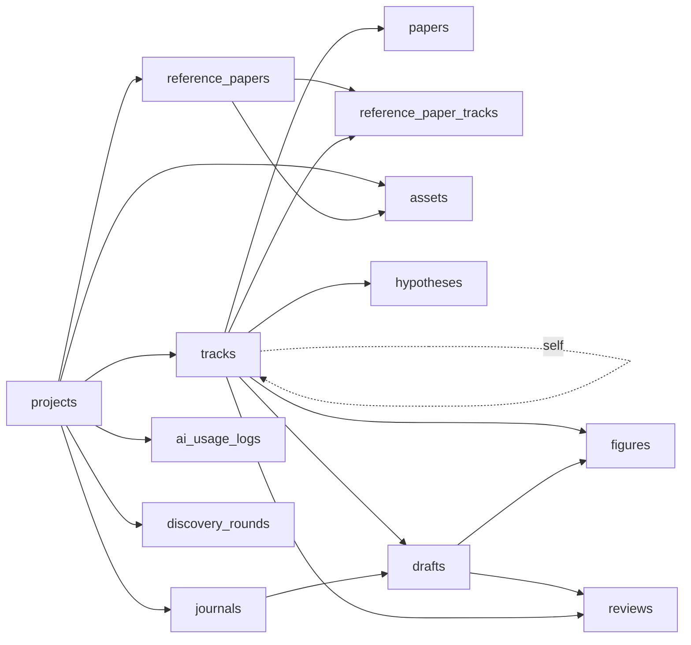
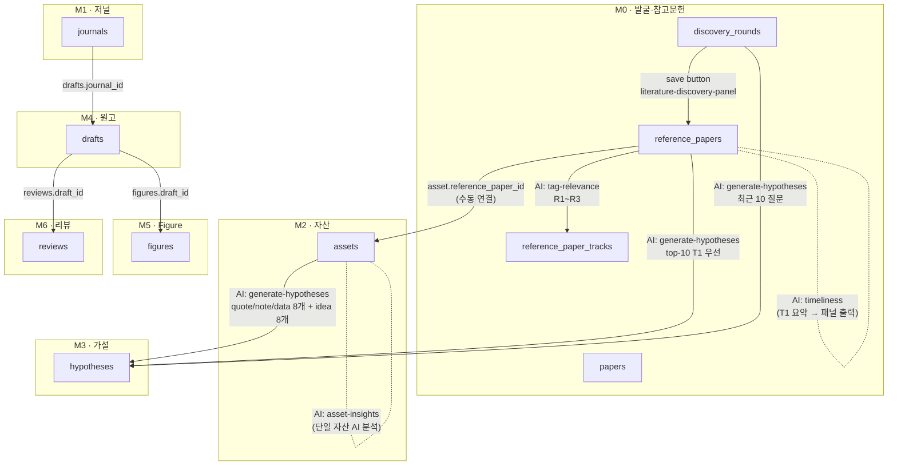

# Phase 0 — Baseline Snapshot

> 생성일: 2026-04-18
> 브랜치: `refactor/phase-0-baseline`
> 대상 커밋: `81319e4` (main)
> 범위: `supabase/schema.sql` (v14까지 반영) + `lib/` + `app/` + `components/`

이 문서는 리팩토링 직전의 코드베이스 스냅샷이다. 이후 Phase 비교 기준이 된다.

---

## 1. 데이터베이스

### 1.1 테이블 목록 (13개)

| # | 테이블 | 스코프 | 정의 위치 | 비고 |
|---|--------|--------|-----------|------|
| 1 | `projects` | 루트 | `schema.sql:34` | `research_intent` + `intent_history`(v9) |
| 2 | `tracks` | project | `schema.sql:69` | `current_stage`(v3), `context_log`(v3) |
| 3 | `papers` | **track** | `schema.sql:112` | M0 트랙별 분석 논문 |
| 4 | `reference_papers` | **project** | `schema.sql:147` | `tier`(v3), `concepts/priority_score`(v6) |
| 5 | `reference_paper_tracks` | junction | `schema.sql:190` | R1/R2/R3 연관도 (v8) |
| 6 | `journals` | project | `schema.sql:229` | `track_analyses` JSONB(v5) |
| 7 | `assets` | project | `schema.sql:268` | `reference_paper_id`(v4), `concepts`(v6), `idea` 타입(v11) |
| 8 | `hypotheses` | track | `schema.sql:308` | `methodology`/`result_notes`(v12) |
| 9 | `drafts` | track | `schema.sql:339` | `journal_id` FK |
| 10 | `figures` | track | `schema.sql:371` | `draft_id` FK |
| 11 | `reviews` | draft | `schema.sql:404` | `draft_id` cascade |
| 12 | `ai_usage_logs` | project(nullable) | `schema.sql:435` | 토큰 사용량 로깅(v7) |
| 13 | `discovery_rounds` | project | `schema.sql:462` | M0 검색 라운드(v10) — JSONB 원본 |

> **행 수**는 로컬·운영 Supabase에서 실측 필요. 권장 쿼리:
> `select relname, n_live_tup from pg_stat_user_tables order by n_live_tup desc;`
> Phase 1 착수 전 사용자가 운영 DB에서 실측 후 이 표에 기입할 것.

### 1.2 외래키 그래프



**CASCADE / SET NULL 요약:**

| 자식 → 부모 | on delete | 비고 |
|-------------|-----------|------|
| `tracks.project_id` → `projects` | CASCADE | schema.sql 기준(migration-v2 no-op 주석 참고) |
| `tracks.parent_track_id` → `tracks` | SET NULL | 자기참조 |
| `papers.track_id` → `tracks` | CASCADE | |
| `reference_papers.project_id` → `projects` | CASCADE | |
| `reference_paper_tracks.*` → `reference_papers/tracks` | CASCADE (양쪽) | |
| `journals.project_id` → `projects` | SET NULL | |
| `assets.project_id` → `projects` | SET NULL | |
| `assets.reference_paper_id` → `reference_papers` | SET NULL | |
| `hypotheses.track_id` → `tracks` | SET NULL | |
| `drafts.track_id` / `journal_id` | SET NULL | |
| `figures.track_id` / `draft_id` | SET NULL | |
| `reviews.draft_id` → `drafts` | CASCADE | |
| `reviews.track_id` → `tracks` | SET NULL | |
| `ai_usage_logs.project_id` → `projects` | SET NULL | |
| `discovery_rounds.project_id` → `projects` | CASCADE | |

### 1.3 RLS

모든 테이블 v13부터 `alter table ... enable row level security` + `allow_all_*` 정책. **현재는 실제 격리 없음** — 전부 통과. Phase 3·5에서 사용자 기반 정책 필요 여부 재검토.

---

## 2. AI 액션 요약 (16개)

### 2.1 공통

- 단일 허브: `lib/ai/generate.ts` → `generateJson()`
- **모델 고정**: `CLAUDE_MODEL = 'claude-haiku-4-5-20251001'` (액션별 오버라이드 없음)
- **기본 maxTokens**: `callClaude` 내부 상수 `2048`
- **기본 temperature**: `generateJson` 기본값 `0.4`
- **프레임워크 프로토콜**: `withFrameworkProtocol(prompt)` 자동 prepend — 단 `opts.skipFrameworkProtocol === true`면 생략
- **로깅**: `opts.meta`가 있으면 `ai_usage_logs`에 fire-and-forget insert
- **재시도**: 429/529 응답 시 5s/10s/15s 백오프, 최대 3회

### 2.2 16개 액션 요약표

프롬프트 길이: `short` <20줄 / `medium` 20–60 / `long` 60+ (메인 템플릿 리터럴 기준)

| 파일 | feature | 길이 | maxTokens | 컨텍스트 소스(테이블) | 호출 위치 | 비고 |
|------|---------|------|-----------|-----------------------|-----------|------|
| `extract-keywords.ts` | `search_keywords` | medium | 기본(2048) | 없음 (인자만) | **호출처 없음** | 🟥 orphan, deprecated 주석 |
| `research-questions.ts` | `research_questions` | medium | 기본 | 없음 | `module0/literature-discovery-panel` | 프레임워크 프로토콜 적용 |
| `journal-track-analysis.ts` | `journal_analysis` | medium | 기본 | (응답 후) `journals` update | `module1/journal-track-analysis-button` | |
| `journal-recommendations.ts` | `journal_recommendation` | medium | **4096** | 없음 | `module1/journal-ai-panel` | 수동 preamble |
| `tag-relevance.ts` | `relevance_tagging` | medium | 기본 | `reference_papers`, `reference_paper_tracks` | `module0/relevance-tag-button`, `batch-relevance-button` | |
| `plan-search.ts` | `search_plan` | **long** | 기본 | 없음 | `module0/literature-discovery-panel` | |
| `synthesize-results.ts` | `search_synthesis` | medium | 기본 | 없음 | `module0/literature-discovery-panel` | |
| `verify-papers.ts` | `paper_verification` | medium | 기본 | 없음 | `module0/literature-discovery-panel` | |
| `timeliness.ts` | `timeliness_analysis` | medium | 기본 | 없음 (T1 요약 인자) | `module0/timeliness-panel` | 프레임워크 프로토콜 적용 |
| `research-keywords.ts` | `search_keywords` | medium | 기본 | 없음 | **호출처 없음** | 🟥 orphan, `search_keywords` 중복 |
| `asset-insights.ts` | `asset_insights` | medium | 기본 | 없음 | `module2/asset-insight-button` | 프레임워크 프로토콜 적용 |
| `topic-recommendations.ts` | `topic_recommendation` | medium | 기본 | 없음 | `module0/literature-discovery-panel` | 프레임워크 프로토콜 적용 |
| `extract-concepts.ts` | `concept_extraction` | medium | 기본 | `reference_papers` (R/W) | `module0/concept-extract-button`, `batch-analyze-button`, `intent-stale-banner` | `recalcPriorityScore`는 AI 없음 & 호출처 없음 |
| `batch-journal-analysis.ts` | — | — | — | `journals` | `module1/batch-journal-analysis-button` | ⚠️ AI 호출 없음 (orchestrator) |
| `batch-tier.ts` | `tier_monitoring` | medium | 2048 (명시) | `reference_papers` (R/W) | `module0/batch-tier-button` | |
| `generate-hypotheses.ts` | `hypothesis_generation` | medium | **4096** | `reference_papers`, `assets`×2, `discovery_rounds` | `module3/hypothesis-ai-panel` | 컨텍스트 소스 최다 |

### 2.3 `AIFeature` 타입 (`lib/ai/generate.ts:13`)

```ts
type AIFeature =
  | 'concept_extraction' | 'journal_analysis' | 'journal_recommendation'
  | 'asset_insights' | 'research_questions' | 'research_keywords'
  | 'topic_recommendation' | 'timeliness_analysis' | 'tier_monitoring'
  | 'relevance_tagging' | 'track_monitoring' | 'search_keywords'
  | 'search_plan' | 'search_synthesis' | 'paper_verification'
  | 'hypothesis_generation' | 'other'
```

**이상 징후:**
- `search_keywords` 는 두 파일(`extract-keywords.ts`, `research-keywords.ts`)에서 동시 사용 → 로그 분류 모호.
- `track_monitoring`, `research_keywords` feature 라벨은 타입엔 있으나 **실제 호출하는 파일이 없음**.
- `extract-keywords.ts`, `research-keywords.ts` 두 파일은 **레포 내 어디서도 import 되지 않음** (dead code).

### 2.4 프레임워크 프로토콜 적용 여부

| 그룹 | 파일 | 처리 |
|------|------|------|
| **자동 prepend** (`skipFrameworkProtocol` 없음) | `research-questions`, `timeliness`, `asset-insights`, `topic-recommendations` | `withFrameworkProtocol` 실행 |
| **수동 preamble** (`skipFrameworkProtocol: true` + 프롬프트에 직접 포함) | `research-keywords`, `journal-recommendations` | 중복 위험 |
| **skip만 하고 preamble 없음** | 그 외 대부분 | 프레임워크 톤 일관성 부족 |

Phase 2A 프롬프트 빌더가 해결해야 할 일관성 이슈.

---

## 3. `papers` vs `reference_papers` 크로스 레퍼런스

### 3.1 두 테이블 비교

| 항목 | `papers` | `reference_papers` |
|------|----------|---------------------|
| 스코프 FK | `track_id` → `tracks` (CASCADE) | `project_id` → `projects` (CASCADE) |
| 의미 | 트랙에서 분석/정독하는 논문 | 프로젝트 전체가 공유하는 참고문헌 풀 |
| 추가 필드 | 없음 (기본 서지 + status/tags) | `tier`(T1~T3), `concepts[]`, `relevance_score`, `priority_score` |
| 트랙 연관도 | — | `reference_paper_tracks` junction으로 R1~R3 |
| Asset 연결 | 없음 | `assets.reference_paper_id` |
| AI 연결 | 없음 | `extract-concepts`, `batch-tier`, `tag-relevance`, `generate-hypotheses` |
| UI 라우트 | `/papers`, `/papers/[id]` | `/reference-papers`, `/reference-papers/[id]`, `/assets` 등 |

실질적으로 `reference_papers`가 **생태계의 중심**이고, `papers`는 "트랙별 정독 노트" 수준으로 축소된 상태.

### 3.2 파일 카테고리별 집계

| 카테고리 | 파일 수 | 대표 파일 |
|----------|--------|-----------|
| `papers`만 사용 | **6** | `lib/actions/papers.ts`, `app/(app)/papers/page.tsx`, `[id]/page.tsx`, `components/module0/paper-form.tsx`, `paper-dialog.tsx`, `lib/actions/tracks.ts`(papers(count) 임베드) |
| `reference_papers`만 사용 | **22** | `lib/actions/reference-papers.ts`, `reference-paper-tracks.ts`, `ai/extract-concepts.ts`, `ai/batch-tier.ts`, `ai/tag-relevance.ts`, `ai/generate-hypotheses.ts`, `app/(app)/reference-papers/**`, `app/(app)/assets/page.tsx`, `module0/*`(배치 버튼·티어·태그), `module2/*`(자산 폼) 등 |
| **둘 다 사용** | **2** | `app/(app)/tracks/[id]/page.tsx` (UI에서 두 목록 병렬 표시), `lib/types.ts` (두 타입 정의) |
| SQL / 시드 | 마이그레이션 v2,v3,v4,v6,v7,v8,v13,v14 + schema.sql + seed-dummy*.sql | `reference_papers` 중심, `papers`는 schema.sql만 |

> 주의: `discovery_rounds.papers` JSONB 컬럼은 **테이블 이름 `papers`와 무관**하다 (검색 결과 원본 저장).

### 3.3 타입 정의 (`lib/types.ts`)

- `Paper` (L117) — `track_id`, 기본 서지 + `status`/`tags` (+ `track` join)
- `ReferencePaper` (L162) — `project_id`, 기본 서지 + **`tier`, `concepts[]`, `relevance_score`, `priority_score`** (+ `project` join)
- `PaperStatus` enum은 **공유** (`'unread'|'reading'|'read'|'key'|'archived'`)
- 입력 DTO: `PaperInput`, `ReferencePaperInput` 분리

### 3.4 미사용/정리 후보 (dead code)

Phase 1 착수 전 병합 제안:

| 파일 | 심볼 | 상태 |
|------|------|------|
| `lib/actions/papers.ts` | `getDashboardStats` | 호출처 없음 |
| `lib/actions/reference-paper-tracks.ts` | `getPaperRelevances` | 호출처 없음 |
| `lib/actions/ai/extract-concepts.ts` | `recalcPriorityScore` | 호출처 없음 |
| `lib/actions/ai/extract-keywords.ts` | 전체 | 호출처 없음 |
| `lib/actions/ai/research-keywords.ts` | 전체 | 호출처 없음 |

---

## 4. 모듈 간 데이터 흐름 (M0~M6)

### 4.1 모듈 개요

| 모듈 | 이름 | 주 테이블 | 스코프 |
|------|------|-----------|--------|
| M0 | 연구 발굴·참고문헌 | `discovery_rounds`, `reference_papers`, `reference_paper_tracks`, `papers` | project + track |
| M1 | 저널 정보 | `journals` | project |
| M2 | 자산 라이브러리 | `assets` | project |
| M3 | 가설·방법론 | `hypotheses` | track |
| M4 | 원고 | `drafts` | track |
| M5 | Figure | `figures` | track |
| M6 | 리뷰 | `reviews` | draft |

### 4.2 현재 연결된 엣지 (실제 구현)



### 4.3 "끊긴 엣지" 진단

| # | 엣지 | 현 상태 | 구분 |
|---|------|---------|------|
| 1 | `discovery_rounds.saved_semantic_ids` → M2 `assets` | 없음. 유저가 asset-form에서 수동 생성 | 🟥 **미완성(버그성)** — 이미 저장한 논문 정보의 재입력 유발 |
| 2 | `reference_papers.concepts` → `assets.concepts` | 없음. asset은 자체 `concepts[]` 컬럼 존재하나 자동 상속 로직 없음 | 🟥 **미완성** — Phase 4 후보 |
| 3 | `assets.reference_paper_id` | 존재. 단 수동 연결만 가능 | 🟨 일부 동작 |
| 4 | `hypotheses` → `drafts` | **FK 없음**. track_id로 간접 연결만 | 🟥 **설계 공백** — Phase 4 |
| 5 | `hypotheses.methodology` → `figures` | **FK/연결 없음** | 🟥 **설계 공백** — Phase 4 |
| 6 | `figures` → `drafts.body` | 단방향 `figures.draft_id`만. body 생성 시 figure 주입 없음 | 🟥 **미완성** — Phase 4 |
| 7 | `papers` (M0 트랙 분석 논문) → 하위 모듈 | 어디에도 흘러가지 않음 | 🟨 **의도된 단절 가능성** — Phase 1 결정 포인트 |
| 8 | `tracks.context_log` → AI 프롬프트 | 현재 **아무 AI 액션도 읽지 않음** | 🟥 **미완성** — Phase 2A 후보 |
| 9 | `journals.track_analyses` → `drafts` 저널 추천 | 없음. `journal-recommendations`는 별도 컨텍스트로 재계산 | 🟨 설계 검토 필요 |

Phase 2B의 확정 게이트에서 각 엣지를 **"자동 연결 원함 / 유지 단절"** 로 명시 결정 필요.

---

## 5. 호출 빈도 · 사용량 지표 (runtime 필요)

정적 분석으로는 산출 불가. Phase 1 착수 전에 다음 쿼리로 실측:

```sql
-- 최근 30일 feature별 호출 횟수·토큰
select feature,
       count(*)              as calls,
       sum(input_tokens)     as input_sum,
       sum(output_tokens)    as output_sum
  from ai_usage_logs
 where created_at > now() - interval '30 days'
 group by feature
 order by calls desc;

-- 프로젝트별 누적
select project_id,
       count(*) as calls,
       sum(input_tokens + output_tokens) as total_tokens
  from ai_usage_logs
 group by project_id
 order by total_tokens desc;
```

결과는 본 문서 §2 표에 **"30일 호출 수"** 열 추가 형태로 사용자가 채워 넣을 것.

---

## 6. 코드 볼륨 요약 (정적)

| 영역 | 파일 수 | 비고 |
|------|--------|------|
| AI 액션 | 16 | `lib/actions/ai/` |
| 일반 server actions | 12 | `lib/actions/*.ts` (papers, reference-papers, reference-paper-tracks, tracks, projects, journals, assets, hypotheses, drafts, figures, reviews, discovery-rounds, ai-usage) |
| App 라우트 페이지 | 21 | `app/**/page.tsx` |
| 모듈 컴포넌트 | 40 | `components/module[0-6]/*.tsx` |
| Supabase 마이그레이션 | 14 (v1~v14) + schema.sql + seed | |

---

## 7. Phase 1~5 착수 전 블로커 체크리스트

- [ ] Supabase 운영 DB에서 §1.1 행 수 실측 기입
- [ ] §5 SQL 실행 후 feature별 호출 수 기입
- [ ] §3.4 dead code 삭제 여부 결정 (Phase 1 PR에 포함 가능)
- [ ] §2.4 `search_keywords` 라벨 중복·`track_monitoring` 고아 feature 정리 방향 확정
- [ ] §4.3 끊긴 엣지 #1 (discovery → asset)의 **의도된 단절 여부** 사용자 판단

블로커가 해소되기 전에는 Phase 1 DDL 작업을 시작하지 않는다.
