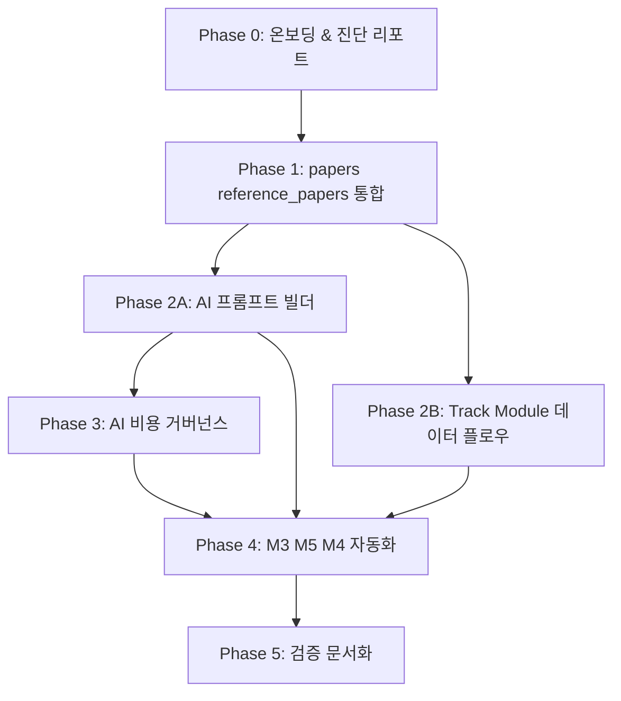
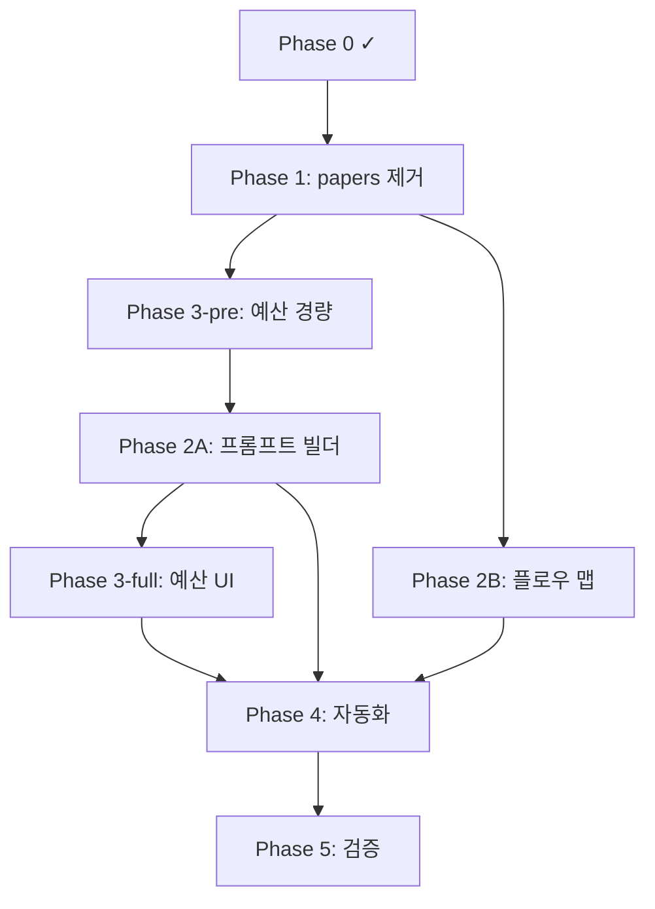

# Opus 4.7 high 풀 리팩토링 로드맵

> 5개 대형 리팩토링을 의존성 순서대로 진행하는 단일 통합 로드맵.
> Opus 4.7 high 세션에서 순차 실행하기 위한 청사진.

---

## 목적

지금까지 Sonnet medium으로 축적된 "작동하는 코드"를, **전체 구조·프롬프트 패턴·모듈 흐름·비용 거버넌스·자동화 파이프라인** 측면에서 고밀도 리팩토링한다.

---

## 원칙

1. **Phase 단위 브랜치 + PR** — 각 Phase는 `refactor/phase-N-xxx` 브랜치에서 작업, 완료 시 PR → main merge.
2. **Phase 끝 확정 게이트** — 사용자 수동 검증 통과 전까지 다음 Phase 금지.
3. **마이그레이션은 UP + DOWN 쌍** — 실행 전 Supabase 백업 필수.
4. **시드 데이터 갱신** — Phase 완료마다 `supabase/seed-dummy.sql` 최신화.
5. **비용 가드레일** — Phase 3(예산 거버넌스)는 가능한 조기 도입해 Opus 작업 중 본인 Claude 비용 폭주 방지.

---

## 의존성 그래프



---

## Phase 0 — 온보딩 & 진단 리포트

**목표:** Opus가 전체 코드베이스를 쥐고 이후 Phase의 기준점을 만든다.

**산출물:**
- `docs/opus-refactor/00-baseline.md` — 현재 상태 스냅샷
  - 테이블 목록 + 행 수 + FK 그래프
  - AI 호출 16개 액션 요약표 (feature, 프롬프트 길이, maxTokens, context 소스, 호출 빈도 추정)
  - `papers`(10개 파일) vs `reference_papers`(10개 파일) 사용처 크로스 레퍼런스
  - 모듈 간 데이터 흐름 현황 (Mermaid)
- `docs/opus-refactor/01-risks.md` — 리팩토링 리스크 등록부 (데이터 손실 가능성, 사용자 수동 작업 필요 지점, 롤백 난이도)

**검증:** 사용자가 baseline 문서를 읽고 사실관계 확인.

---

## Phase 1 — `papers` vs `reference_papers` 통합

**문제:** 동일한 개념의 2개 테이블. `papers`(트랙 스코프) + `reference_papers`(프로젝트 스코프). 10개 파일에 분기 로직 누적.

**결정 필요 지점:**
- **A안)** `reference_papers`로 통일, `papers` 제거 → track_id는 `reference_paper_tracks`로 이관
- **B안)** `papers`로 통일, `project_id` + `track_id` 모두 허용
- **C안)** 단일 `papers` + `paper_scope` enum(`project` | `track`) 도입

**산출물:**
- `docs/opus-refactor/phase1-design.md` — 3개 안 비교 + Opus 추천 + 사용자 확정 기록
- `supabase/migration-v15.sql` (필요 시 v15~v17 분리) — 결정된 안의 DDL + 데이터 이관 + DOWN 스크립트
- 영향받는 10개 파일 리팩토링:
  - `app/(app)/papers/**`, `app/(app)/reference-papers/**`
  - `components/module0/paper-form.tsx`, `reference-paper-form.tsx`, `tier-selector.tsx`
  - `components/module0/literature-discovery-panel.tsx`
  - `app/(app)/tracks/[id]/page.tsx`, `app/(app)/assets/page.tsx`
- `lib/types.ts` 단일 `Paper` 타입으로 통합
- E2E 수동 검증 체크리스트 (기존 저장된 논문 조회/편집/삭제)

**롤백:** 마이그레이션 `DOWN` 스크립트 동반.

**확정 게이트:** 사용자 로컬에서 "연구 자산"/"참고문헌" 페이지 수동 검증 후 confirm.

---

## Phase 2A — AI 프롬프트·컨텍스트 빌더 추상화

**문제:** 16개 AI 액션이 각자 `supabase.from(...).select(...)` → 문자열 슬라이싱 → 프롬프트 템플릿 리터럴을 반복. 프롬프트 일관성·재사용성 없음.

**현재 상태:**
- 단일 허브: [`lib/ai/generate.ts`](../../lib/ai/generate.ts) `generateJson()`
- 16개 액션 위치: [`lib/actions/ai/`](../../lib/actions/ai/)
- 프롬프트마다 수동 문자열 조립 (예: [`generate-hypotheses.ts`](../../lib/actions/ai/generate-hypotheses.ts))

**설계 방향 (Opus가 구체화):**

```ts
// lib/ai/context-builder.ts  (신규)
class AIContextBuilder {
  constructor(projectId: string, trackId?: string)
  withResearchIntent(): this
  withReferencePapers(opts: { limit?: number; tierMin?: number; abstractMaxChars?: number }): this
  withAssets(types: AssetType[], limit?: number): this
  withDiscoveryQuestions(limit?: number): this
  withHypotheses(status?: HypothesisStatus[]): this
  build(): Promise<{ sections: PromptSection[]; meta: ContextMeta }>
}

// lib/ai/prompt-composer.ts  (신규)
function composePrompt(task: PromptTask, ctx: PromptContext): string
```

**산출물:**
- `lib/ai/context-builder.ts` + `prompt-composer.ts`
- 16개 AI 액션 중 **우선 5개** 리팩토링:
  - `generate-hypotheses.ts`
  - `journal-recommendations.ts`
  - `topic-recommendations.ts`
  - `synthesize-results.ts`
  - `extract-concepts.ts`
- 나머지 11개는 Phase 2A 후반에 일괄 변환
- `docs/opus-refactor/phase2a-prompt-patterns.md` — 새 추상화 사용 가이드 + Do/Don't

**검증:**
- 리팩토링 전후 동일 입력에 대한 Claude 응답 일관성 테스트 (snapshot)
- `ai_usage_logs`의 input_tokens가 의미 있게 증가하지 않는지 확인 (컨텍스트 빌더가 불필요한 중복 포함하지 않도록)

---

## Phase 2B — Track → Module 데이터 플로우 End-to-End 재검토

**문제:** M0~M6 모듈이 독립적으로 발전. 모듈 간 데이터가 실제로 흐르는지, 끊긴 곳이 어딘지 불명확.

**산출물:**
- `docs/opus-refactor/phase2b-flow-map.md` — 6개 모듈 실제 데이터 의존성 그래프 (Mermaid)
- "끊긴 엣지" 목록 예시:
  - M0 `discovery_rounds.saved_semantic_ids` → M2 asset 자동 생성? (현재 수동)
  - M2 asset concepts → M3 hypothesis generation에 전달? (현재 일부만)
  - M3 hypothesis.methodology → M5 figure 초기화? (없음)
  - M5 figure → M4 draft body? (없음)
- 끊긴 엣지 중 **의도된 단절**과 **버그/미완성**을 구분
- 미완성만 보강하는 수정 목록 (구현은 Phase 4에서)

**확정 게이트:** 사용자가 흐름도를 보고 "자동 연결 원함/원치 않음" 결정.

---

## Phase 3 — AI 비용 거버넌스

**현재 상태:**
- [`lib/actions/ai-usage.ts`](../../lib/actions/ai-usage.ts) 에 조회는 있으나 **제한·경고 없음**
- `ai_usage_logs` 테이블에 project_id 기준 누적만 됨

**설계 방향:**
1. **월별 예산 설정 테이블** (`ai_budgets`: project_id, monthly_limit_usd, warning_threshold_pct)
2. **`generate.ts` 전처리 훅** — 호출 전 이번 달 누적 조회 → 한도 초과 시 `BudgetExceededError`
3. **UI 경고** — 80% 도달 시 대시보드 배너, 100% 도달 시 AI 버튼 비활성화
4. **기능별 quota** (선택) — `hypothesis_generation`은 월 10회 등

**산출물:**
- `supabase/migration-v1N.sql` — `ai_budgets` 테이블 + 인덱스 + RLS
- `lib/actions/ai-budget.ts` — CRUD + 현재 사용량 대비 조회
- `lib/ai/generate.ts` 확장 — 호출 전 한도 체크
- `components/settings/ai-budget-panel.tsx` — 예산 설정 UI
- `components/layout/ai-budget-banner.tsx` — 전역 경고 배너

**결정 필요 지점:**
- Hard limit (초과 시 완전 차단) vs Soft limit (경고만)
- 기본 예산값 (월 $10? $20?)
- 프로젝트별 vs 전역 예산

---

## Phase 4 — M3 가설 → M5 Figure → M4 Draft 자동화

**전제:** Phase 2B 흐름도에서 "자동 연결 원함"으로 결정된 엣지만 구현.

**예상 범위:**
- M3 hypothesis를 저장하면 → M5에 figure placeholder 자동 생성 (methodology 기반)
- M3 hypothesis.methodology + M5 figures + M2 assets → M4 draft의 Methods/Results 섹션 초안 생성
- 각 자동화는 **"자동 제안 → 사용자 승인"** 패턴 유지 (AI 버튼으로 트리거, 자동 삽입 금지)

**새 AI 액션 예상:**
- `lib/actions/ai/generate-figure-plan.ts` — 가설에서 필요한 figure 도출
- `lib/actions/ai/generate-draft-section.ts` — 섹션별 초안

**산출물:**
- Phase 2A의 프롬프트 빌더를 사용하는 2~3개 신규 AI 액션
- M3/M5/M4 페이지에 "연결" UI (이전 단계 결과를 끌어와 다음 단계 시딩)
- 데이터 혈통(provenance) 필드:
  - `figures.generated_from_hypothesis_id`
  - `drafts.source_figures` (text[] 또는 별도 join 테이블)
- 마이그레이션 v1N — provenance 필드 추가

**확정 게이트:** 더미 프로젝트로 M3→M5→M4 전체 flow 손수 검증.

---

## Phase 5 — 검증 & 문서화

**산출물:**
- `docs/opus-refactor/final-architecture.md` — 리팩토링 후 최종 구조도
- `docs/opus-refactor/migration-log.md` — v15~v1N 마이그레이션 목록과 실행 순서
- `supabase/schema.sql` 재생성 (Phase 1,3,4 마이그레이션 반영)
- `AGENTS.md` 업데이트 — 새 프롬프트 빌더 사용법, 새 데이터 플로우 설명
- 제거된 파일 목록 (unused actions, legacy components)

---

## 실행 가드레일

| 항목 | 규칙 |
|---|---|
| 브랜치 전략 | `refactor/phase-N-xxx` 브랜치 → PR → main merge |
| 마이그레이션 | UP + DOWN 쌍으로 작성, 실행 전 Supabase 스냅샷 백업 |
| 테스트 데이터 | `supabase/seed-dummy.sql` 업데이트 → Phase 전후 로컬 재현 |
| 비용 관리 | Phase 2A 착수 전에 Phase 3를 경량 도입(로깅·경고만) 권장 |
| 중단 조건 | 어느 Phase든 예상 밖 복잡도 발견 시 중단하고 사용자 보고 |
| 변경 금지 | Phase 2A 이전에는 `lib/ai/generate.ts` 주요 시그니처 변경 금지 (후속 Phase 기반) |

---

## 진행 상태

| Phase | 상태 | 브랜치 | PR | 비고 |
|---|---|---|---|---|
| 0. 온보딩·진단 | **approved** | `refactor/phase-0-baseline` | (PR 대기) | 확정 게이트 통과 2026-04-18 |
| 1. papers 통합 | **approved** | `refactor/phase-1-papers-consolidation` | (PR 대기) | 통과 2026-04-18. migration-v15 적용 필요 |
| 3-pre. 예산 경량 | **review** | `refactor/phase-3-pre-budget` | (PR 대기) | migration-v16 + generate.ts pre-call check |
| 2A. 프롬프트 빌더 | pending | — | — | 3-pre 확정 후 착수 |
| 2B. 플로우 맵 | pending | — | — | 2A와 병렬 가능 |
| 3-full. 예산 UI | pending | — | — | 2A 이후 |
| 4. M3→M5→M4 자동화 | pending | — | — | Discovery→Asset 자동화 포함 |
| 5. 검증·문서화 | pending | — | — | |

각 Phase 완료 시 이 표를 업데이트하고 브랜치/PR 링크를 기입한다.

---

## Phase 0 결정 사항 (2026-04-18 사용자 확정)

Phase 0 게이트에서 확정된 사항. 이후 Phase 설계는 이 결정을 전제로 한다.

### D-1. `papers` 테이블은 **제거**한다 (Phase 1 A안)
- 사유: 운영 DB `select count(*) from papers` = 0. 실제 사용 이력 없음.
- 범위: 테이블 drop + 6개 참조 파일 제거/이관 + `Paper` 타입 제거
- `papers.notes` 이관 로직 불필요 (데이터 없음). 그러나 마이그레이션 스크립트는 **행 수 체크 후 0이 아니면 ABORT** 하는 안전장치 포함.

### D-2. RLS는 `allow_all` 유지 (개발 단계)
- Phase 3·5에서 멀티유저 전환 시 재검토
- Phase 3의 `ai_budgets` 도 `allow_all` 정책으로 시작

### D-3. Dead code 5건은 Phase 1 PR에 포함하여 정리
- `lib/actions/papers.ts` → 파일 전체 제거 (D-1에 포함)
- `lib/actions/ai/extract-keywords.ts` → 제거
- `lib/actions/ai/research-keywords.ts` → 제거
- `lib/actions/reference-paper-tracks.ts` `getPaperRelevances` → 제거
- `lib/actions/ai/extract-concepts.ts` `recalcPriorityScore` → 제거
- `AIFeature` 타입에서 `search_keywords`, `research_keywords`, `track_monitoring` 제거

### D-4. Discovery → Asset 자동 생성 (Phase 4 범위)
- `discovery_rounds.saved_semantic_ids` 가 가리키는 논문이 `reference_papers`에 insert될 때 → 해당 논문의 key concept을 담은 `asset` 자동 생성
- 자동 생성 자산 타입: `reference` 또는 `note` (Phase 4에서 구체화)
- Phase 2B 흐름 맵에서 **"자동 연결"** 으로 이미 결정된 엣지로 표기
- 사후에 수동 전환 가능하도록 설계

### D-5. Phase 3 분리: Phase 2A 착수 **전** 경량판 선도입
- **Phase 3-pre** (Phase 2A 착수 전 필수):
  - `ai_budgets` 테이블 생성 (project_id, monthly_limit_usd, warning_threshold_pct)
  - `lib/ai/generate.ts` 호출 전 이번 달 누적 조회 → 경고 로그 출력
  - **선택적 차단 게이트**: `estimate_tokens` 휴리스틱(프롬프트 길이 × 4 등) 기반 사전 추정 → 한도 초과 예상 시 `throw BudgetEstimateError` 또는 env 플래그로 우회 허용
  - UI 없음 (Phase 3-full로)
- **Phase 3-full** (Phase 2A 이후 본편):
  - UI 경고 배너, 예산 설정 패널
  - 기능별 quota
  - Hard limit vs Soft limit 결정

### 실행 시점 영향
- Phase 1 바로 착수 가능 (분기 결정 완료)
- Phase 2A는 Phase 3-pre 완료 후에만 착수
- 의존성 그래프 갱신:


